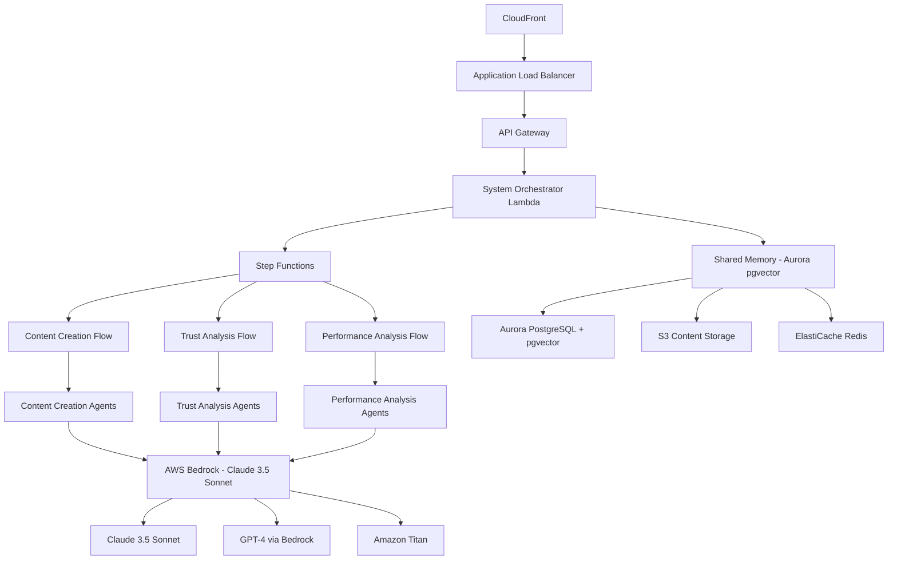

# Design Document: Agent Content Platform

## Overview

The Agent Content Platform is a sophisticated multi-agent system built on AWS serverless architecture that enables users to move fluidly between Content Creation (Gamma-style generation), Trust Analysis (credibility evaluation), and Performance Analytics (feedback loops). The platform implements a "Shared Memory" architecture where every action, draft, and analysis result is stored in Aurora PostgreSQL with pgvector to improve future agent performance automatically.

The design emphasizes seamless user flow transitions while maintaining feature independence, allowing each capability to operate autonomously while benefiting from shared learning. This serverless approach using AWS Step Functions, Lambda, and Bedrock ensures scalability, cost-effectiveness, and the ability to evolve each feature independently while maintaining the critical shared memory learning loop.

### Success Criteria and Design Goals
The platform is designed to achieve specific measurable outcomes:
- **Flow Continuity**: >20% of Trust Analysis sessions result in "Recreate Safely" handoff to Content Creator through seamless Step Function integration
- **Memory Utilization**: 100% of Performance Insights are indexed into Aurora pgvector Shared Memory within 5 minutes through automated learning loops
- **Latency**: Full draft generation (Ideation + Structuring) completes in <15 seconds through optimized Step Function orchestration and Bedrock integration

## Architecture

### High-Level AWS Architecture



### AWS Services Architecture

#### Core Infrastructure
- **Amazon CloudFront**: Global content delivery and caching
- **Application Load Balancer**: Traffic distribution and SSL termination
- **Amazon API Gateway**: RESTful API management and throttling
- **AWS Lambda**: Serverless compute for all agent functions
- **AWS Step Functions**: Orchestration for each distinct user flow (Creation, Trust, Performance)
- **Amazon Aurora PostgreSQL with pgvector**: Shared Memory for cross-feature learning

#### AI/ML Services
- **AWS Bedrock**: Foundation model access and management
  - Claude 3.5 Sonnet for complex reasoning and content creation
  - GPT-4 for specialized analysis tasks
  - Amazon Titan for embeddings and text processing
- **Amazon Comprehend**: Natural language processing for sentiment and entity analysis
- **Amazon Rekognition**: Image and video analysis for fake media detection

#### Data Storage
- **Amazon Aurora PostgreSQL with pgvector**: Primary shared memory system for user profiles, agent learning, and cross-feature insights
- **Amazon S3**: Content storage, analysis results, and large data objects
- **Amazon ElastiCache (Redis)**: Session management and high-speed caching
- **Amazon DynamoDB**: Real-time operational data and agent state management

## User-Authorized Session Observation Model

The platform implements a secure session-based observation model for performance analysis that respects user privacy and platform policies.

### Session Architecture
Users authenticate directly within an in-app browser window for session-based analysis.  
The system stores only encrypted session references in ElastiCache Redis, never credentials.
Session tokens are automatically expired and rotated according to platform policies.

### Performance Analysis Security Model
All performance analysis operations are:
- **User-initiated**: Analysis only occurs when explicitly requested by the user
- **Session-bound**: Tied to active, validated sessions with proper scope verification
- **Time-limited**: Sessions expire automatically with configurable timeouts (default 1 hour)
- **Fully revocable**: Users can revoke access immediately, invalidating all stored session data
- **Audit-logged**: All session activities are logged in CloudWatch for compliance
- **DOM Signal Extraction**: Extract visible engagement metrics from platform UI elements during user-initiated analysis
- **No Background Polling**: No autonomous metric collection or background polling permitted

### Implementation Details
- **Session Validation Lambda**: Validates session scope and expiration before any analysis
- **In-Browser Session Management**: Secure session handling within in-app browser windows
- **Session Cleanup**: Automatic cleanup of expired sessions and associated temporary data
- **Privacy Controls**: Users can view and manage all active sessions through the dashboard
- **DOM Signal Extraction Agent**: Extracts visible metrics from platform UI during explicit user-initiated analysis


#### Security and Monitoring
- **AWS IAM**: Identity and access management
- **Amazon Cognito**: User authentication and authorization
- **AWS CloudWatch**: Monitoring, logging, and alerting
- **AWS X-Ray**: Distributed tracing for agent interactions
- **AWS Secrets Manager**: API keys and sensitive configuration

#### Scalability and Performance Architecture
- **Auto Scaling**: Lambda functions automatically scale to handle 1000+ concurrent users per NFR-09
- **Connection Pooling**: Aurora PostgreSQL with RDS Proxy for efficient database connections
- **Caching Strategy**: ElastiCache Redis for session management and frequently accessed shared memory data
- **Content Delivery**: CloudFront global distribution for low-latency access
- **Load Balancing**: Application Load Balancer with health checks and automatic failover
- **Concurrency Management**: Lambda reserved concurrency and error handling per NFR-10
- **Read Replicas**: Aurora read replicas for shared memory queries with eventual consistency per NFR-11

#### Reliability and Fault Tolerance Architecture
- **High Availability**: Multi-AZ deployment for 99.9% uptime per NFR-13
- **Graceful Degradation**: Circuit breaker patterns for individual agent failures per NFR-14
- **Retry Logic**: Exponential backoff for transient AWS service failures per NFR-15
- **Data Consistency**: Aurora ACID properties with proper conflict resolution per NFR-16
- **Health Checks**: CloudWatch health monitoring for all critical components
- **Dead Letter Queues**: Failed message handling for Step Function and SQS operations
- **Cross-Region Backup**: S3 cross-region replication for disaster recovery

### Core Components

#### System Orchestrator (AWS Lambda + API Gateway)
The central nervous system implemented as a collection of Lambda functions behind API Gateway:
- **Request Routing Lambda**: Analyzes incoming requests and directs them to appropriate Step Function workflows
- **Authentication Lambda**: Integrates with Amazon Cognito for user session management
- **Context Management Lambda**: Maintains user context in ElastiCache Redis and Aurora shared memory
- **Feature Coordination Lambda**: Manages cross-feature handoffs (Trust → Creation, Performance → Shared Memory)
- **Dashboard Lambda**: Serves the global entry point with three feature cards

#### Shared Memory System (Aurora PostgreSQL + pgvector + S3 + ElastiCache)
A multi-tier storage system optimized for the learning loop architecture:
- **Aurora PostgreSQL with pgvector**: Core shared memory storing vectorized insights, user preferences, and cross-feature learning patterns
- **S3 Buckets**: Long-term storage of content history, analysis results, and large objects
- **ElastiCache Redis**: High-speed caching for frequently accessed data and session state
- **DynamoDB**: Real-time operational data for agent coordination and system state

## Components and Interfaces

### Feature 1: Content Creation Studio (Step Functions + Lambda + Bedrock)

#### AWS Implementation Architecture
Gamma-style wizard interface powered by AWS Step Functions orchestrating sequential agent execution using Lambda functions and AWS Bedrock.

#### Components

**Content Creation Step Function**
- Orchestrates the sequential Ideation → Structuring workflow as defined in requirements CRE-02
- Manages state transitions between wizard screens (Platform → Type → Topic → Generation)
- Handles user actions: Edit Manually, Regenerate, Save as Draft, Verify with Trust Engine
- Integrates with Aurora shared memory for tone/style preferences retrieval

**Ideation Agent Lambda**
- Uses Claude 3.5 Sonnet via Bedrock for creative concept generation
- Queries Aurora shared memory for user preferences and successful patterns from performance analysis
- Generates multiple angles/concepts based on platform, type, and topic inputs
- Stores intermediate results in S3 for user review and selection

**Structuring Agent Lambda**
- Processes selected ideas and formats them into platform-specific templates
- Uses Amazon Titan for text structuring and organization
- Applies platform-specific formatting rules stored in Aurora shared memory
- Ensures logical flow through LLM-powered coherence checking

**Trust Integration Handler Lambda**
- Manages the "Verify with Trust Engine" handoff as specified in requirement CRE-04
- Seamlessly transfers draft content to Trust Analysis Step Function
- Maintains context for potential "Recreate Safely" return flow

#### AWS-Specific Content Creation Interfaces

```typescript
// AWS Step Function Event Interfaces
interface ContentCreationStepFunctionInput {
  userId: string;
  requestId: string;
  wizardStep: 'platform' | 'type' | 'topic' | 'generation';
  platform: 'twitter' | 'linkedin' | 'instagram' | 'youtube';
  contentType: 'post' | 'carousel' | 'thread' | 'script';
  topic: string;
  tone?: string;
  preferences: UserContentPreferences;
  sharedMemoryContext: SharedMemoryContext;
}

interface BedrockIdeationRequest {
  modelId: 'anthropic.claude-3-5-sonnet-20241022-v2:0';
  body: {
    anthropic_version: string;
    max_tokens: number;
    messages: BedrockMessage[];
    temperature: number;
    system: string;
  };
  sharedMemoryInsights: PerformanceInsight[];
}

interface AuroraSharedMemoryQuery {
  userId: string;
  queryType: 'preferences' | 'successful_patterns' | 'performance_insights';
  platform?: string;
  contentType?: string;
  vectorSimilarity?: {
    embedding: number[];
    threshold: number;
  };
}
```

### Feature 2: Trust Analysis Engine (Step Functions + Lambda + AI Services)

#### AWS Implementation Architecture
Independent analysis pipeline using Step Functions to orchestrate parallel agent execution for comprehensive content evaluation as specified in requirements TRU-01 through TRU-04.

#### Components

**Trust Analysis Step Function**
- Handles three input modes: Paste Text, Paste URL (with scraper Lambda), Upload Media (S3 presigned URL)
- Orchestrates parallel execution of Fact Check, Bias Detection, and Fake Media agents
- Manages optional context injection for analysis guidance
- Coordinates decision paths: "Recreate Safely" vs "Do Not Reuse"

**Trust Agent Cluster (Lambda Functions)**
- **Fact Check Agent Lambda**: Uses Bedrock Claude for claim verification and logical consistency analysis
- **Bias Detection Agent Lambda**: Uses Amazon Comprehend and custom models for emotional manipulation detection
- **Fake Media Agent Lambda**: Integrates Amazon Rekognition for image/video forensic analysis
- **Tone Analysis Agent Lambda**: Uses Comprehend sentiment analysis for tone evaluation
- Implements parallel processing through Step Function parallel states
- Uses Aurora shared memory for "Past False Positives" context

**Trust Report Generator Lambda**
- Compiles individual agent findings from Step Function execution results
- Calculates overall credibility scores using weighted algorithms
- Generates split-screen report layout with risk highlights and verification markers
- Provides "Recreate Safely" guidance with specific constraints for Content Creation handoff

**Content Recreation Safety Lambda**
- Analyzes safe recreation elements using Bedrock reasoning
- Identifies legal and ethical concerns through rule-based systems stored in Aurora
- Provides alternative approaches and constraints for safe content recreation
- Manages handoff back to Content Creation Step Function with analysis constraints

#### AWS-Specific Trust Analysis Interfaces

```typescript
interface TrustAnalysisStepFunctionInput {
  userId: string;
  requestId: string;
  inputMode: 'text' | 'url' | 'media';
  content: TrustContentInput;
  context?: string; // Optional context injection per TRU-02
  analysisDepth: 'quick' | 'standard' | 'comprehensive';
  recreationGuidance: boolean;
  sharedMemoryContext: PastFalsePositives[];
}

interface TrustContentInput {
  type: 'text' | 'url' | 's3-object';
  data: string; // Text content, URL, or S3 key
  s3Bucket?: string; // For media uploads
  platform?: string;
  author?: string;
  scraperTimeout: 5000; // 5 second timeout per NFR-02
}

interface TrustReportOutput {
  credibilityScore: number;
  riskHighlights: RiskHighlight[];
  verificationMarkers: VerificationMarker[];
  decisionPaths: {
    recreateSafely: {
      available: boolean;
      constraints: string[];
      safeElements: string[];
    };
    doNotReuse: {
      reasons: string[];
      riskLevel: 'low' | 'medium' | 'high' | 'critical';
    };
  };
}

interface ComprehendAnalysisResult {
  sentiment: {
    sentiment: 'POSITIVE' | 'NEGATIVE' | 'NEUTRAL' | 'MIXED';
    sentimentScore: {
      positive: number;
      negative: number;
      neutral: number;
      mixed: number;
    };
  };
  entities: Array<{
    text: string;
    type: string;
    score: number;
  }>;
  keyPhrases: Array<{
    text: string;
    score: number;
  }>;
}
```

### Feature 3: Post Performance Analyzer (Step Functions + Lambda + Analytics)

#### AWS Implementation Architecture
Metrics-driven analysis pipeline using Step Functions to orchestrate the learning loop that feeds back into Aurora shared memory as specified in requirements PRF-01 through PRF-04.

#### Components

**Performance Analysis Step Function**
- Performs performance analysis using user-authorized, in-browser session observation
- Extracts engagement metrics from visible platform UI elements during user-initiated analysis
- Does not rely on official social media APIs for metrics collection
- Orchestrates parallel analysis across Engagement, Hook, Timing, and CTA dimensions
- Manages the critical learning loop that vectorizes insights into Aurora shared memory
- Ensures insights are available for Content Creation agent queries

**Session-Based Observation Agent Cluster (Lambda Functions)**
- **Session Context Manager Lambda**: Validates session scope, expiration, and user consent before any observation occurs
- **DOM Signal Extraction Agent Lambda**: Extracts visible engagement metrics from platform UI during explicit user-initiated analysis
- **Metric Normalization Agent Lambda**: Converts platform-specific UI signals into standardized numeric performance metrics
- Enforces session-based access controls and blocks analysis when sessions are invalid or expired

**Session-Based Observation Agent Cluster (Lambda Functions)**
- **Session Context Manager Lambda**: Validates session scope, expiration, and user consent before any observation occurs
- **DOM Signal Extraction Agent Lambda**: Extracts visible engagement metrics from platform UI during explicit user-initiated analysis
- **Metric Normalization Agent Lambda**: Converts platform-specific UI signals into standardized numeric performance metrics
- Enforces session-based access controls and blocks analysis when sessions are invalid or expired

**Analysis Agent Cluster (Lambda Functions)**
- **Engagement Analysis Agent Lambda**: Processes metrics and correlates them to topic and content elements
- **Hook Effectiveness Agent Lambda**: Uses Bedrock to analyze opening lines and attention-grabbing elements
- **Timing Analysis Agent Lambda**: Analyzes posting schedules using statistical models and historical data
- **CTA Performance Agent Lambda**: Measures call-to-action effectiveness using conversion tracking
- Implements parallel processing through Step Function parallel states
- Uses Aurora shared memory for historical pattern comparison

**Insights & Learning Agent Lambda**
- Synthesizes findings from analysis agents into actionable patterns
- Generates specific insights (e.g., "Questions in hooks increase reach by 20%")
- Vectorizes insights using Amazon Titan embeddings for storage in Aurora pgvector
- Ensures insights are immediately available for Content Creation agent queries
- Implements the critical learning loop specified in requirement PRF-03

**Shared Memory Integration Lambda**
- Manages the vectorization and storage of performance insights in Aurora pgvector
- Ensures insights are properly indexed and searchable by Content Creation agents
- Maintains the 5-minute SLA for insight availability specified in success criteria
- Handles the implicit querying mechanism for requirement PRF-04

#### AWS-Specific Performance Analysis Interfaces

```typescript
interface PerformanceAnalysisStepFunctionInput {
  userId: string;
  requestId: string;
  sessionContext: {
    platform: string;
    sessionId: string;
    expiresAt: number;
  };
  posts: PostIdentifier[];
  timeframe: DateRange;
  comparisonBaseline?: 'user_average' | 'industry_benchmark';
  insightDepth: 'summary' | 'detailed' | 'strategic';
  learningLoopEnabled: true; // Always true per PRF-03
}

interface PostIdentifier {
  platform: string;
  postId: string;
  publishedAt: Date;
  contentS3Key?: string; // Reference to original content
  metricsSnapshot: SocialMetrics;
}

interface SocialMetrics {
  likes: number;
  shares: number;
  comments: number;
  reach: number;
  impressions: number;
  clicks?: number;
  saves?: number;
  engagementRate: number;
}

interface PerformanceInsight {
  insightId: string;
  pattern: string; // e.g., "Questions in hooks increase reach by 20%"
  confidence: number;
  applicablePlatforms: string[];
  contentTypes: string[];
  embedding: number[]; // Vector embedding for Aurora pgvector
  generatedAt: Date;
  validatedBy: {
    sampleSize: number;
    statisticalSignificance: number;
  };
}

interface AuroraSharedMemoryInsert {
  userId: string;
  insightType: 'engagement' | 'hook' | 'timing' | 'cta';
  insight: PerformanceInsight;
  vectorEmbedding: number[];
  metadata: {
    platform: string;
    contentType: string;
    performanceMetrics: SocialMetrics;
  };
}
```

### Session-Based Performance Integrity
- Performance metrics must be extracted only during explicit user-initiated actions
- No background polling or autonomous metric collection is permitted
- Session references must never include credentials or long-lived cookies
- Partial or unavailable metrics must be clearly flagged in analysis outputs
### Session-Based Performance Integrity
- Performance metrics must be extracted only during explicit user-initiated actions
- No background polling or autonomous metric collection is permitted
- Session references must never include credentials or long-lived cookies
- Partial or unavailable metrics must be clearly flagged in analysis outputs


## Compliance and Security Architecture

### Data Privacy and Protection
The platform implements comprehensive data privacy controls to meet regulatory requirements:

- **GDPR Compliance**: Full compliance for EU users with data subject rights including data export and deletion
- **Data Encryption**: AES-256 encryption at rest (Aurora, S3, DynamoDB) and TLS 1.3 in transit
- **Right to Deletion**: Complete data removal including vector embeddings from Aurora pgvector
- **Data Export**: Machine-readable format for user data portability
- **Consent Management**: Granular consent for different data processing activities

### Content Guidelines and Safety
- **Platform Policy Compliance**: Respect content policies of all integrated social media platforms
- **Harmful Content Prevention**: Safeguards against generating misleading, harmful, or inappropriate content
- **Audit Trails**: Complete logging of all content analysis and generation decisions in CloudWatch
- **Content Moderation**: Integration with AWS content moderation services
- **Legal Disclaimer**: Clear terms regarding AI-generated content responsibility

### Security and Access Control
- **Zero Trust Architecture**: All internal communications require authentication and authorization
- **IAM Best Practices**: Least privilege access with regular access reviews
- **Secrets Management**: AWS Secrets Manager for all API keys and sensitive configuration
- **Audit Logging**: CloudTrail integration for all administrative actions
- **Incident Response**: Defined procedures for security incidents and data breaches

## Data Models

### AWS-Optimized Data Models

#### Aurora PostgreSQL with pgvector Schema

**Shared Memory Tables**
```sql
-- User profiles and preferences
CREATE TABLE user_profiles (
    user_id UUID PRIMARY KEY,
    email VARCHAR(255) UNIQUE NOT NULL,
    cognito_id VARCHAR(255) UNIQUE NOT NULL,
    preferences JSONB,
    created_at TIMESTAMP DEFAULT NOW(),
    updated_at TIMESTAMP DEFAULT NOW()
);

-- Performance insights with vector embeddings
CREATE TABLE performance_insights (
    insight_id UUID PRIMARY KEY,
    user_id UUID REFERENCES user_profiles(user_id),
    pattern TEXT NOT NULL,
    confidence FLOAT,
    applicable_platforms TEXT[],
    content_types TEXT[],
    embedding vector(1536), -- OpenAI/Titan embedding dimension
    generated_at TIMESTAMP DEFAULT NOW(),
    validation_data JSONB
);

-- Content history with trust scores
CREATE TABLE content_history (
    content_id UUID PRIMARY KEY,
    user_id UUID REFERENCES user_profiles(user_id),
    content_type VARCHAR(50),
    platform VARCHAR(50),
    s3_location JSONB,
    trust_score FLOAT,
    performance_metrics JSONB,
    created_at TIMESTAMP DEFAULT NOW()
);

-- Trust analysis results
CREATE TABLE trust_analyses (
    analysis_id UUID PRIMARY KEY,
    content_id UUID REFERENCES content_history(content_id),
    credibility_score FLOAT,
    risk_highlights JSONB,
    recreation_guidance JSONB,
    analyzed_at TIMESTAMP DEFAULT NOW()
);

-- Vector similarity indexes
CREATE INDEX ON performance_insights USING ivfflat (embedding vector_cosine_ops);
```

#### DynamoDB Operational Tables

**Step Function Execution States**
```typescript
interface StepFunctionStateDDB {
  PK: string; // EXECUTION#{executionId}
  SK: string; // STATE#{timestamp}
  executionId: string;
  stateMachine: 'content-creation' | 'trust-analysis' | 'performance-analysis';
  status: 'running' | 'succeeded' | 'failed' | 'timed_out';
  userId: string;
  input: any;
  output?: any;
  startTime: string;
  endTime?: string;
  ttl: number; // Auto-expire old executions
}
```

**Session Management**
```typescript
interface SessionStateDDB {
  PK: string; // SESSION#{sessionId}
  SK: string; // USER#{userId}
  sessionId: string;
  userId: string;
  cognitoTokens: {
    accessToken: string;
    refreshToken: string;
    idToken: string;
  };
  currentFeature?: string;
  contextData: any;
  expiresAt: number;
  ttl: number;
}
```

#### ElastiCache Redis Schema

**Session Management**
```typescript
interface RedisSession {
  key: `session:${sessionId}`;
  value: {
    userId: string;
    cognitoTokens: {
      accessToken: string;
      refreshToken: string;
      idToken: string;
    };
    userContext: {
      currentFeature?: string;
      preferences: UserPreferences;
      recentActivity: Activity[];
    };
    expiresAt: number;
  };
  ttl: 3600; // 1 hour
}
```

**Agent Coordination Cache**
```typescript
interface RedisAgentCoordination {
  key: `coordination:${taskId}`;
  value: {
    orchestratorId: string;
    agents: {
      agentId: string;
      status: string;
      lastUpdate: string;
    }[];
    sharedState: any;
    locks: string[];
  };
  ttl: 1800; // 30 minutes
}
```

## Correctness Properties

*A property is a characteristic or behavior that should hold true across all valid executions of a system—essentially, a formal statement about what the system should do. Properties serve as the bridge between human-readable specifications and machine-verifiable correctness guarantees.*

### System Orchestration Properties

**Property 1: Request routing consistency**
*For any* user request, the System_Orchestrator should route it to the same feature pipeline when given identical request characteristics and system state
**Validates: Requirements 1.1**

**Property 2: Authentication context establishment**
*For any* valid user credentials, successful authentication should establish user context that persists across all subsequent operations within the session
**Validates: Requirements 1.2**

**Property 3: Pipeline selection determinism**
*For any* combination of user permissions, request type, and system resources, the System_Orchestrator should make consistent pipeline selection decisions
**Validates: Requirements 1.3**

**Property 4: Error message clarity**
*For any* routing failure, the System_Orchestrator should provide error messages that contain specific failure reasons and actionable alternative approaches
**Validates: Requirements 1.4**

**Property 5: Ambiguous request handling**
*For any* request that could be handled by multiple features, the System_Orchestrator should either present options or apply defaults based on user history consistently
**Validates: Requirements 1.5**

### Shared Memory Properties

**Property 6: Profile data completeness**
*For any* user interaction, the Shared_Memory should maintain complete records of preferences, usage patterns, and historical interactions without data loss
**Validates: Requirements 2.1**

**Property 7: Rule accessibility consistency**
*For any* platform rule stored in Shared_Memory, all agents should have immediate access to the current version of that rule
**Validates: Requirements 2.2**

**Property 8: Analysis preservation**
*For any* completed analysis, the Shared_Memory should preserve all results in a format that enables future reference and pattern recognition
**Validates: Requirements 2.3**

**Property 9: Performance tracking completeness**
*For any* performance metric, the Shared_Memory should maintain historical data that enables trend analysis and future content recommendations
**Validates: Requirements 2.4**

**Property 10: Data conflict resolution**
*For any* data conflict scenario, the Shared_Memory should apply consistent resolution strategies while maintaining overall data integrity
**Validates: Requirements 2.5**

### Content Creation Properties

**Property 11: Agent coordination completeness**
*For any* content creation request, the Content_Creation_Studio should successfully coordinate all required specialized agents to produce comprehensive output
**Validates: Requirements 3.1**

**Property 12: Ideation cluster collaboration**
*For any* ideation task, the Idea Agent, Trend Agent, and POV Agent should collaborate to produce ideas that incorporate elements from each agent's specialization
**Validates: Requirements 3.2**

**Property 13: Content structure coherence**
*For any* set of generated ideas, the Content_Structurer_Agent should organize them into output that maintains logical flow and narrative consistency
**Validates: Requirements 3.3**

**Property 14: Optimization integrity preservation**
*For any* content optimization, the Hook_CTA_Optimizer should enhance engagement elements while preserving the core message and factual accuracy
**Validates: Requirements 3.4**

**Property 15: Trust integration consistency**
*For any* content creation request that includes trust analysis, the integration with Trust Analysis Engine should produce safer content recommendations
**Validates: Requirements 3.5**

### Trust Analysis Properties

**Property 16: Content processing completeness**
*For any* content input (URL, text, or media), the Trust_Analysis_Engine should successfully process it through all applicable specialized trust evaluation agents
**Validates: Requirements 4.1**

**Property 17: Trust agent coordination**
*For any* content evaluation, the Trust_Analysis_Engine should coordinate all relevant agents (Fact Check, Bias, Fake Media, Tone) to produce comprehensive analysis
**Validates: Requirements 4.2**

**Property 18: Trust report completeness**
*For any* analyzed content, the Trust_Report_Agent should generate reports containing credibility scores, identified red flags, and recreation safety assessments
**Validates: Requirements 4.3**

**Property 19: Risk highlighting consistency**
*For any* content that poses risks, the Trust_Analysis_Engine should identify specific concerns and provide actionable mitigation recommendations
**Validates: Requirements 4.4**

**Property 20: Recreation guidance specificity**
*For any* content requiring recreation guidance, the Recreation_Agent should specify both safe elements to copy and elements to avoid with clear reasoning
**Validates: Requirements 4.5**

### Performance Analysis Properties

**Property 21: Performance data processing**
*For any* user account data and post metrics, the Performance_Analyzer should successfully process them through all relevant specialized analysis agents
**Validates: Requirements 5.1**

**Property 22: Analysis agent coordination**
*For any* performance evaluation, the Performance_Analyzer should coordinate Engagement, Hook, Timing, and CTA agents to produce comprehensive insights
**Validates: Requirements 5.2**

**Property 23: Insight explanation completeness**
*For any* analyzed content performance, the Insights_Learning_Agent should provide explanations for success/failure and extract actionable patterns
**Validates: Requirements 5.3**

**Property 24: Pattern recognition consistency**
*For any* performance data set, the Performance_Analyzer should identify successful patterns and provide specific, actionable improvement recommendations
**Validates: Requirements 5.4**

**Property 25: Incomplete data handling**
*For any* scenario with insufficient performance data, the Performance_Analyzer should either request additional metrics or provide analysis based on available data
**Validates: Requirements 5.5**

### Cross-Feature Integration Properties

**Property 26: Safe recreation routing**
*For any* trust analysis that identifies safe recreation opportunities, the System_Orchestrator should correctly route findings to Content Creation Studio when requested
**Validates: Requirements 6.1**

**Property 27: Pattern storage consistency**
*For any* successful pattern identified by performance analysis, the Shared_Memory should store insights in a format accessible for future content generation
**Validates: Requirements 6.2**

**Property 28: Success tracking completeness**
*For any* successful content output from content creation, the Performance_Analyzer should track results to enable strategy validation and refinement
**Validates: Requirements 6.3**

**Property 29: Cross-feature data integrity**
*For any* cross-feature learning operation, the System_Orchestrator should maintain data flow integrity and user privacy throughout the process
**Validates: Requirements 6.4**

**Property 30: Integration conflict resolution**
*For any* integration conflict, the System_Orchestrator should prioritize user preferences and feature-specific requirements consistently
**Validates: Requirements 6.5**

### Agent Cluster Coordination Properties

**Property 31: Resource allocation conflict prevention**
*For any* concurrent agent cluster operations, the System_Orchestrator should manage resource allocation without conflicts while maintaining performance
**Validates: Requirements 7.1**

**Property 32: Agent communication consistency**
*For any* agent-to-agent communication within a cluster, the System_Orchestrator should ensure data consistency and proper operation sequencing
**Validates: Requirements 7.2**

**Property 33: Cluster failure recovery**
*For any* cluster operation failure, the System_Orchestrator should implement recovery procedures and provide meaningful error reporting
**Validates: Requirements 7.3**

**Property 34: Workload distribution optimization**
*For any* scaling scenario, the System_Orchestrator should distribute workload across available agents while maintaining quality standards
**Validates: Requirements 7.4**

**Property 35: Task assignment optimization**
*For any* scenario with overlapping agent specializations, the System_Orchestrator should optimize task assignment based on capabilities and current workload
**Validates: Requirements 7.5**

### User Experience Properties

**Property 36: Interface integration consistency**
*For any* user session, the System_Orchestrator should present all three core features through a unified interface that maintains consistent interaction patterns
**Validates: Requirements 8.1**

**Property 37: Context preservation across features**
*For any* feature transition, the System_Orchestrator should maintain user context and provide smooth transitions without data loss
**Validates: Requirements 8.2**

**Property 38: Output formatting consistency**
*For any* results from different features, the System_Orchestrator should format outputs consistently while preserving all feature-specific information
**Validates: Requirements 8.3**

**Property 39: Contextual help provision**
*For any* user help request, the System_Orchestrator should provide guidance that is contextually appropriate for the current feature and user state
**Validates: Requirements 8.4**

**Property 40: Workflow automation suggestions**
*For any* scenario where workflow automation is possible, the System_Orchestrator should offer intelligent suggestions for connecting feature outputs to inputs
**Validates: Requirements 8.5**

## Error Handling

### AWS-Specific Error Classification and Response Strategies

#### AWS Service-Level Errors
- **Lambda Timeout Errors**: Implement Step Functions for long-running processes with proper state management
- **Aurora Connection Errors**: Implement connection pooling and retry logic for shared memory access
- **S3 Access Errors**: Implement IAM role validation, use pre-signed URLs for secure access
- **Bedrock Rate Limiting**: Implement request queuing, use multiple model endpoints for load distribution
- **API Gateway Throttling**: Implement client-side rate limiting, use usage plans for different user tiers
- **Step Function Execution Limits**: Implement proper state machine design with error handling states

#### Feature-Level Errors
- **Content Creation Failures**: Store partial results in S3, maintain wizard state in Redis for recovery
- **Trust Analysis Limitations**: Store confidence levels in Aurora, implement 5-second timeout for URL scraping per NFR-02
- **Performance Analysis Gaps**: Implement graceful degradation when social media APIs are unavailable
- **Shared Memory Inconsistencies**: Implement eventual consistency handling and conflict resolution

#### Cross-Feature Integration Errors
- **Step Function Handoff Failures**: Implement retry policies and dead letter queues for failed handoffs
- **Trust → Creation Handoff**: Maintain analysis context in Redis for "Recreate Safely" operations
- **Performance → Shared Memory**: Ensure 5-minute SLA for insight availability with monitoring and alerts
- **Shared Memory Query Failures**: Implement fallback to cached insights in Redis

### AWS Error Recovery Mechanisms

#### Automatic Recovery
- **Step Function Retries**: Configure automatic retry with exponential backoff for transient failures
- **Aurora Point-in-Time Recovery**: Enable automatic backups for shared memory data recovery
- **S3 Cross-Region Replication**: Implement disaster recovery across AWS regions
- **CloudWatch Auto-Scaling**: Automatically adjust Lambda concurrency based on demand
- **Shared Memory Consistency**: Implement automatic conflict resolution for concurrent updates

#### User-Assisted Recovery
- **CloudWatch Dashboards**: Provide real-time system health visibility with feature-specific metrics
- **Step Function Execution History**: Allow users to view and retry failed workflows
- **API Gateway Error Responses**: Return structured error messages with recovery suggestions
- **Wizard State Recovery**: Restore user progress in Content Creation wizard from Redis cache

## Testing Strategy

### AWS-Optimized Testing Approach

The Agent Content Platform requires comprehensive testing across AWS services, Lambda functions, and AI model integrations to ensure correctness in the cloud environment.

#### Unit Testing Focus
- **Lambda Function Contracts**: Verify each Lambda responds correctly to AWS event formats (API Gateway, SQS, SNS)
- **AWS Service Integration**: Test DynamoDB operations, S3 storage/retrieval, and Bedrock model invocations
- **Error Conditions**: Validate AWS service failures, timeout handling, and retry logic
- **Cross-Service Workflows**: Test data flow between Lambda functions via SQS/SNS
- **Authentication and Authorization**: Verify Cognito integration and IAM role permissions

#### Property-Based Testing Focus
- **System Orchestration**: Verify routing, authentication, and coordination properties across all AWS Lambda invocations
- **Agent Coordination**: Test cluster behavior with randomly generated agent states in DynamoDB
- **Data Consistency**: Verify DynamoDB and S3 maintain integrity across concurrent Lambda executions
- **Feature Pipeline Behavior**: Test each feature's core properties with diverse content inputs via Bedrock
- **Cross-Feature Integration**: Verify integration properties work across all feature combinations through SNS/SQS

### AWS-Specific Testing Configuration

**Testing Framework**: 
- **Python**: Use Hypothesis with boto3 mocking via moto library
- **TypeScript**: Use fast-check with AWS SDK mocking via aws-sdk-mock
- **Infrastructure**: Use AWS CDK for test environment provisioning

**Test Environment Setup**:
- **LocalStack**: Local AWS service emulation for development testing
- **AWS Test Account**: Isolated AWS account for integration testing
- **Test Data Isolation**: Separate DynamoDB tables and S3 buckets with test prefixes

**Test Iterations**: Minimum 100 iterations per property test with AWS service call mocking
**Test Tagging**: Each property test must reference its design document property:
- **Feature: agent-content-platform, Property {number}: {property_text}**

### AWS Service Testing Patterns

#### Lambda Function Testing
```typescript
// Example property test for Lambda function
describe('Content Creation Lambda Properties', () => {
  test('Property 11: Agent coordination completeness', async () => {
    await fc.assert(fc.asyncProperty(
      fc.record({
        userId: fc.string(),
        prompt: fc.string(),
        contentType: fc.constantFrom('post', 'article', 'video_script'),
        platform: fc.constantFrom('twitter', 'linkedin', 'instagram')
      }),
      async (request) => {
        // Mock AWS services
        mockDynamoDB.mockReturnValue(/* agent states */);
        mockBedrock.mockReturnValue(/* LLM responses */);
        
        const result = await contentCreationHandler(request);
        
        // Verify all required agents were coordinated
        expect(result.agentsInvolved).toContain('idea-agent');
        expect(result.agentsInvolved).toContain('trend-agent');
        expect(result.agentsInvolved).toContain('pov-agent');
        expect(result.content).toBeDefined();
      }
    ));
  });
});
```

#### DynamoDB Consistency Testing
- Test eventual consistency scenarios with multiple Lambda functions
- Verify GSI query patterns work correctly across all access patterns
- Test TTL behavior for automatic data cleanup

#### S3 Integration Testing
- Test large object storage and retrieval for content and analysis results
- Verify S3 event triggers for Lambda functions work correctly
- Test cross-region replication for disaster recovery scenarios

#### Bedrock Model Testing
- Mock Bedrock responses for consistent testing
- Test model selection logic based on task requirements
- Verify prompt engineering produces expected output formats

### Integration Testing Strategy

#### AWS Service Integration Testing
- Test complete workflows from API Gateway through Lambda to storage
- Verify SQS message processing and dead letter queue handling
- Validate SNS topic fan-out for cross-feature communication

#### Cross-Feature Integration Testing
- Test optional integration scenarios using SNS/SQS message passing
- Verify data privacy and security during cross-feature operations via IAM roles
- Validate workflow automation suggestions and execution through Step Functions

#### System-Level Testing
- Test System Orchestrator behavior under various load conditions using CloudWatch metrics
- Verify shared memory consistency under concurrent Lambda executions
- Validate error handling and recovery across the entire AWS infrastructure

This comprehensive AWS-optimized testing strategy ensures that the complex multi-agent system maintains correctness, reliability, and performance across all AWS services while providing confidence in the system's ability to handle the diverse and dynamic nature of content creation, trust analysis, and performance evaluation workflows in a cloud-native environment.

#### ElastiCache Redis Schema

**Session Management**
```typescript
interface RedisSession {
  key: `session:${sessionId}`;
  value: {
    userId: string;
    cognitoTokens: {
      accessToken: string;
      refreshToken: string;
      idToken: string;
    };
    userContext: {
      currentFeature?: 'content-creation' | 'trust-analysis' | 'performance-analysis';
      wizardState?: WizardState;
      preferences: UserPreferences;
      recentActivity: Activity[];
    };
    expiresAt: number;
  };
  ttl: 3600; // 1 hour
}
```

**Feature Context Cache**
```typescript
interface RedisFeatureContext {
  key: `context:${userId}:${feature}`;
  value: {
    currentWorkflow: string;
    stepFunctionExecutionArn?: string;
    temporaryData: any;
    sharedMemoryCache: {
      lastQueried: string;
      cachedInsights: PerformanceInsight[];
    };
  };
  ttl: 1800; // 30 minutes
}
```